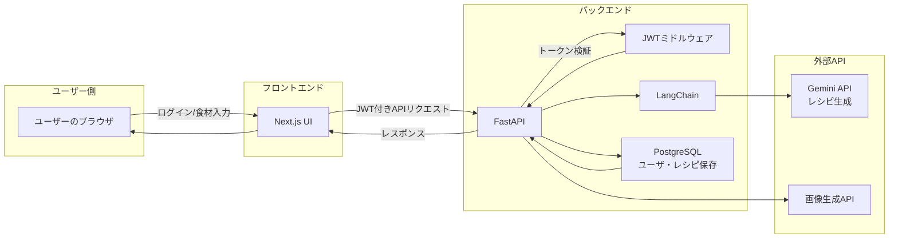

# 冷蔵庫の在庫 × 異世界のレシピ

## 技育CAMPハッカソン2025 Vol.4「努力賞」受賞作品🏆
- こちらのプロジェクトは「技育CAMPハッカソン2025年度 Vol.4」で制作した作品です。
- 開発期間：2025年5月28日〜6月8日

## プロジェクト概要
- 家にある食材だけで、**存在しない国の伝統料理**をGeminiが考案し、画像付きで提案してくれるサービスです。
    例）じゃがいも、みそ、ヨーグルト →
    「北東フェロー諸島・聖ミルダ神殿で朝に食される、冷製味噌ジャガカッテージポタージュ」

さらに、他のユーザーが生成した“空想グルメ”もSNS風に閲覧・共有可能。

## プロジェクト説明

**1. 対象ユーザー**
- 毎日の献立に悩む人

- 創作料理が好きな人

- AI × 創造にワクワクする人

- 世界に一つだけのレシピを楽しみたい人

**2. 解決したい課題**
- 「家に食材はあるけど、何を作ればいいか分からない」問題
- 食のマンネリ化
- 想像力と遊び心の不足

**3. システム特徴**
- Gemini API を活用し、存在しない国の文化や背景を含めたオリジナルレシピを生成
- Gemini画像生成APIと連携して料理のビジュアルも自動生成
- 他の人が生成したレシピを一覧・検索できるコミュニティ要素

## システムアーキテクチャ


## 技術スタック
- Frontend: Next.js, TypeScript, Tailwind CSS
- Backend: Python, FastAPI, Docker, Gemini API

## 起動
>[!NOTE]
>MacOSを対象
1. リポジトリをClone
    ```bash
    git clone https://github.com/jacksen-ng/camp-06.git
    docker-compose up
    ```
2. フロントエンド
    ```bash
    cd frontend
    npm install
    npm run dev
    ```
3. バックエンド
    ```bash
    cd backend
    ```

    `.env`ファイルを作る
    ```bash 
    GEMINI_API_KEY=xxx
    SECRET_KEY=xxx
    DATABASE_URL=xxx
    ```

    `venv`起動
    ```python
    python -m venv .venv
    source .venv/bin/source
    ```

    `requirements.txt`のインストール
    ```bash
    pip install -r requirements.txt
    ```

    起動
    ```python
    python -m uvicorn main:app --reload --host 0.0.0.0 --port 8000
    ```


